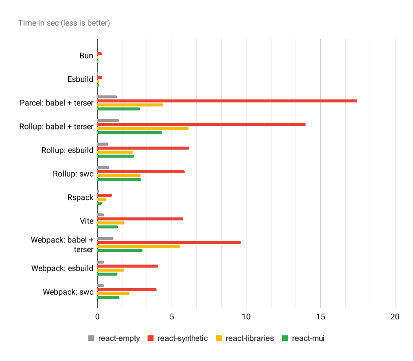

# JS Bundler Benchmark

Performance benchmark for most popular javascript bundlers in various configurations

- [bun](https://bun.sh/)
- [esbuild](https://esbuild.github.io/)
- [parcel](https://parceljs.org/) (babel + terser)
- [rollup](https://rollupjs.org/) (babel + terser, esbuild, swc)
- [rspack](https://rspack.dev/) (swc)
- [vite](https://vitejs.dev/) (esbuild)
- [webpack](https://webpack.js.org/) (babel + terser, esbuild, swc)

Available test projects (all of them based on React):

- empty project
- project containing five big libraries
- all components from Material UI
- synthetic test with 5000 small components

## Results

All tests were done on 2023 MacBook Pro 12-core M2 Pro with 32gb of RAM, Mac OS 15.0 and Node 20.17.0, production build, no cache, configs are as close as possible



Time in sec (average time for 5 runs)

|                             | **react-empty** | **react-libraries** | **react-mui** | **react-synthetic** | 
|-----------------------------|-----------------|---------------------|---------------|---------------------| 
| **Bun**                     | 0.011           | 0.057               | 0.068         | 0.308               | 
| **Esbuild**                 | 0.031           | 0.083               | 0.089         | 0.325               | 
| **Parcel: babel + terser**  | 1.316           | 4.401               | 2.872         | 17.466              | 
| **Rollup: babel + terser**  | 1.458           | 6.134               | 4.350         | 14.006              | 
| **Rollup: esbuild**         | 0.742           | 2.402               | 2.450         | 6.180               | 
| **Rollup: swc**             | 0.795           | 2.887               | 2.932         | 5.880               | 
| **Rspack**                  | 0.087           | 0.587               | 0.292         | 0.974               | 
| **Vite**                    | 0.446           | 1.809               | 1.361         | 5.772               | 
| **Webpack: babel + terser** | 1.090           | 5.551               | 3.044         | 9.645               | 
| **Webpack: esbuild**        | 0.443           | 1.787               | 1.331         | 4.086               | 
| **Webpack: swc**            | 0.422           | 2.167               | 1.492         | 3.975               |

Bundle size in KiB

|                             | **react-empty** | **react-libraries** | **react-mui** | **react-synthetic** | 
|-----------------------------|-----------------|---------------------|---------------|---------------------| 
| **Bun**                     | 163.22          | 1331.20             | 663.83        | 1024.00             | 
| **Esbuild**                 | 164.86          | 1310.72             | 666.33        | 1008.75             | 
| **Parcel: babel + terser**  | 169.44          | 1433.60             | 714.51        | 1167.36             | 
| **Rollup: babel + terser**  | 157.56          | 1290.24             | 615.93        | 786.49              | 
| **Rollup: esbuild**         | 163.65          | 1310.72             | 668.09        | 816.64              | 
| **Rollup: swc**             | 157.16          | 1269.76             | 611.67        | 790.97              | 
| **Rspack**                  | 162.00          | 1648.64             | 689.53        | 1413.12             | 
| **Vite**                    | 160.37          | 1300.48             | 622.57        | 832.99              | 
| **Webpack: babel + terser** | 158.17          | 1536.00             | 623.89        | 868.34              | 
| **Webpack: esbuild**        | 163.51          | 1689.60             | 646.26        | 889.73              | 
| **Webpack: swc**            | 160.64          | 1525.76             | 627.59        | 875.75              |

Bundle size after gzip in KiB

|                             | **react-empty** | **react-libraries** | **react-mui** | **react-synthetic** | 
|-----------------------------|-----------------|---------------------|---------------|---------------------| 
| **Bun**                     | 54.87           | 389.86              | 199.13        | 109.30              | 
| **Esbuild**                 | 54.88           | 384.98              | 199.05        | 132.58              | 
| **Parcel: babel + terser**  | 55.05           | 390.18              | 201.00        | 87.83               | 
| **Rollup: babel + terser**  | 52.84           | 369.56              | 180.82        | 68.29               | 
| **Rollup: esbuild**         | 54.82           | 386.29              | 201.29        | 83.74               | 
| **Rollup: swc**             | 52.47           | 366.57              | 180.96        | 67.83               | 
| **Rspack**                  | 53.38           | 449.28              | 196.34        | 133.70              | 
| **Vite**                    | 53.56           | 383.90              | 187.17        | 81.82               | 
| **Webpack: babel + terser** | 53.00           | 426.50              | 183.90        | 83.20               | 
| **Webpack: esbuild**        | 55.13           | 464.27              | 195.34        | 85.44               | 
| **Webpack: swc**            | 53.68           | 427.49              | 185.49        | 91.95               | 


## How to run it

First you must install the npm dependencies (don't forget to install them for each project), after that you can use following commands

- `npm run build:bun`
- `npm run build:esbuild`
- `npm run build:parcel`
- `npm run build:rollup`
- `npm run build:rspack`
- `npm run build:vite`
- `npm run build:webpack`

Common options

- `--project <string>` project from `./projects` directory
- `--entrypoint <string>` project entry point, default `src/index.tsx`

Rollup and Webpack support various presets

- `--preset <babel|esbuild|swc>` preset used for bundling, default `babel`

Examples

```shell
npm run build:esbuild -- --project react-empty --entrypoint src/index.tsx
npm run build:webpack -- --project react-empty --preset swc --entrypoint src/index.tsx
```

Don't forget to add `--` after npm script to [pass arguments](https://docs.npmjs.com/cli/v6/commands/npm-run-script#description)
