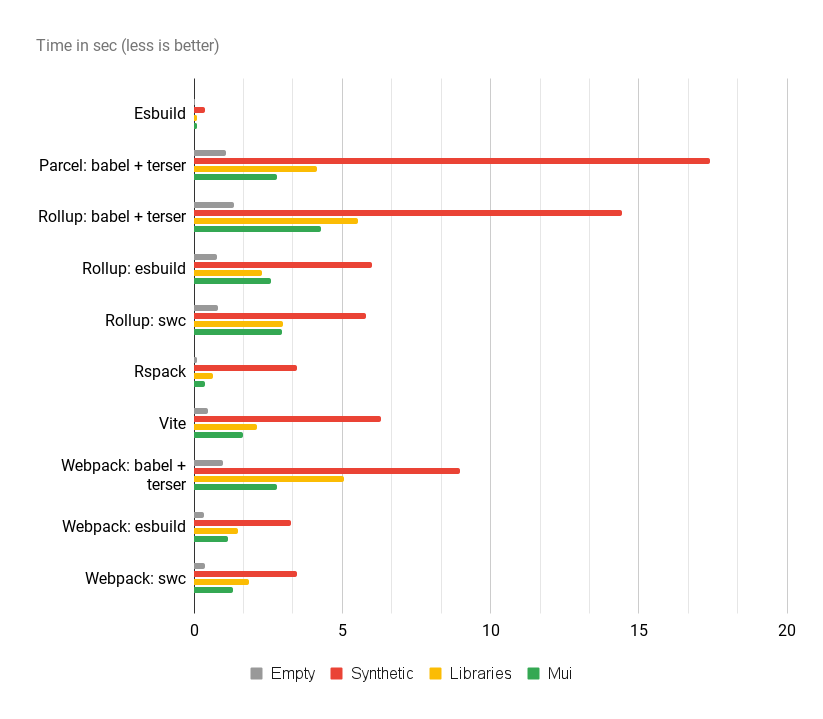

# JS Bundler Benchmark

Performance benchmark for most popular javascript bundlers in various configurations

- [esbuild](https://esbuild.github.io/)
- [parcel](https://parceljs.org/) (babel + terser)
- [rollup](https://rollupjs.org/) (babel + terser, esbuild, swc)
- [rspack](https://rspack.dev/) (swc)
- [webpack](https://webpack.js.org/) (babel + terser, esbuild, swc)

Available test projects (all of them based on React):

- empty project
- project containing five big libraries
- all components from Material UI
- synthetic test with 5000 small components

## Results

All tests were done on a 6-core 2019 MacBook Pro with 16gb of RAM, Mac OS 11.5.2 and Node 16.20.0, production build, no cache, configs are as close as possible



Time in sec (average time for 3 runs)

|                             | **Empty** | **Libraries** | **Mui** | **Synthetic** |
| --------------------------- | --------- | ------------- | ------- | ------------- |
| **Esbuild**                 | 0.046     | 0.142         | 0.192   | 0.685         |
| **Parcel: babel + terser**  | 3.737     | 11.529        | 8.892   | 57.232        |
| **Rollup: babel + terser**  | 3.121     | 13.056        | 9.495   | 37.689        |
| **Rollup: esbuild**         | 1.874     | 5.553         | 5.746   | 14.612        |
| **Rollup: swc**             | 1.788     | 5.966         | 5.802   | 14.644        |
| **Rspack**                  | 0.192     | 1.308         | 0.607   | 5.730         |
| **Webpack: babel + terser** | 2.471     | 11.529        | 6.406   | 23.889        |
| **Webpack: esbuild**        | 0.808     | 3.145         | 2.665   | 8.798         |
| **Webpack: swc**            | 0.849     | 4.033         | 2.927   | 9.134         |

Bundle size in KiB

|                             | **Empty** | **Libraries** | **Mui** | **Synthetic** |
| --------------------------- | --------- | ------------- | ------- | ------------- |
| **Esbuild**                 | 164.60    | 1239.04       | 607.99  | 1008.50       |
| **Parcel: babel + terser**  | 348.28    | 1546.24       | 950.09  | 1351.68       |
| **Rollup: babel + terser**  | 157.85    | 1454.08       | 592.64  | 786.78        |
| **Rollup: esbuild**         | 163.61    | 1239.04       | 621.77  | 816.58        |
| **Rollup: swc**             | 166.95    | 1351.68       | 712.35  | 1064.96       |
| **Rspack**                  | 167.08    | 1382.40       | 755.95  | 1638.40       |
| **Webpack: babel + terser** | 158.33    | 1464.32       | 593.95  | 868.48        |
| **Webpack: esbuild**        | 166.17    | 1617.92       | 613.37  | 891.19        |
| **Webpack: swc**            | 163.00    | 1454.08       | 600.74  | 878.15        |

Bundle size after gzip in KiB

|                             | **Empty** | **Libraries** | **Mui** | **Synthetic** |
| --------------------------- | --------- | ------------- | ------- | ------------- |
| **Esbuild**                 | 54.75     | 367.50        | 183.51  | 132.16        |
| **Parcel: babel + terser**  | 106.91    | 424.13        | 264.39  | 139.05        |
| **Rollup: babel + terser**  | 52.81     | 353.12        | 173.57  | 67.34         |
| **Rollup: esbuild**         | 54.68     | 368.10        | 185.70  | 84.23         |
| **Rollup: swc**             | 54.24     | 368.08        | 190.88  | 93.57         |
| **Rspack**                  | 54.38     | 376.50        | 199.42  | 140.82        |
| **Webpack: babel + terser** | 52.90     | 407.58        | 175.36  | 84.42         |
| **Webpack: esbuild**        | 56.04     | 445.32        | 185.35  | 86.71         |
| **Webpack: swc**            | 54.49     | 409.35        | 178.29  | 93.34         |

## How to run it

First you must install the npm dependencies (don't forget to install them for each project), after that you can use following commands

- `npm run build:esbuild`
- `npm run build:parcel`
- `npm run build:rollup`
- `npm run build:rspack`
- `npm run build:webpack`

Common options

- `--project <string>` project from `./projects` directory
- `--entrypoint <string>` project entry point, default `src/index.tsx`

Rollup and Webpack support various presets

- `--preset <babel|esbuild|swc>` preset used for bundling, default `babel`

Examples

```shell
npm run build:esbuild -- --project react-empty --entrypoint src/index.tsx
npm run build:webpack -- --project react-empty --preset swc --entrypoint src/index.tsx
```

Don't forget to add `--` after npm script to [pass arguments](https://docs.npmjs.com/cli/v6/commands/npm-run-script#description)
